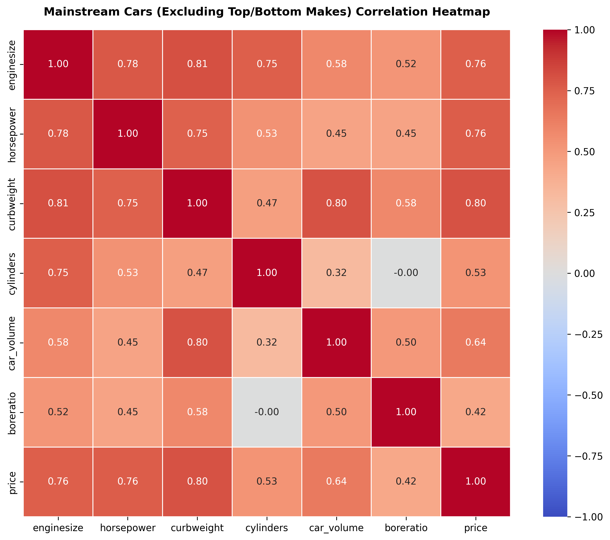

# 

# Car Price Analysis

## Background

The project aims to analyse the car market in the US to provide evidence for a business using a public dataset. Specifically for a Chinese car company called Geely Auto which aims to enter the U.S. market. They which to make an evidence-based series of decision to help the compete against European competition and directly with American brands. Their aim is to use measurable factors from sales data to identify the significant variables like engine size, horsepower, brand reputation, safety features, fuel efficiency, vehicle type, and additional technological advances to evaluate how it affects the price. The objective is to see if those factors differ in the US to China. The dataset will give us the which factors affect the car price in the US market. From the data we want to know which car features move in a predictable way with price and which ones do not.
With these results Geely can suggest strategic decision about product design and features which will help set an appropriate point that will drive price. They will then look at the price point information — they’ll use it to shape their entire U.S. market strategy as pricing data is one of the most powerful levers when entering a mature, competitive market like the U.S. Geely then position themselves against competitors with precision to avoid assumptions and make decisions based on real American market behaviour.

## Data set content.

For this project the data source Kaggle and there are just 205 cars. The dataset tells us details about the car, from its size, engine specification, fuel, power, aspiration (turbo) efficiency and price. Limitations is we’re not told where in the US its sold, nor by who. We can assume they’re all new cars without mileage and randomly sourced from various states around the US. This potentially limits the reliability of the conclusions for example location bias due to climate or state wealth.

## Business requirements and goals

They want to finds positive coefficients in any of the data they’ve obtained to tell them which features of cars American buyers are willing to pay more for. So, aim is to identify which features are worth investing in for their export market and to design vehicles that match American preferences to boost sales.

## User Stories

- **CEO** Of Geely Auto, wants an executive-level analysis of the primary mathematical price drivers across global automotive data.
  So that I can strategically benchmark our vehicle lineup, optimize pricing against European rivals, and capture market share without destroying profit margins.
- **Marketing manager** wants a data-driven breakdown of positive and negative feature correlations with vehicle price,
  So that he can focus campaign messaging on high-value selling points and avoid promoting features that do not drive buyer interest. showing which vehicle features command a statistically significant price premium in our target market. So that I can design localized ad campaigns that promote features proven to drive buyer value and avoid wasting budget on features consumers ignore.
- **Production manager** want to be able to use the model that best preducts the exact price impact of key design specs.
  So that they can evaluate manufacturing adjustments and make cost-effective production decisions that maximize profit margins.
- **Data Analysts** they want to rank and select features based on their impact on model RMSE,
  So that I can train a high-accuracy regression model for predicting vehicle prices.
  Acceptance Criteria:
  The system calculates and outputs feature importance scores ranked by RMSE impact.
  The top-performing feature combination yields the lowest overall RMSE score.
  The output provides a clear, numerical summary that can be directly fed into the price prediction model.

## What answers am I looking for from the dataset?

#### Questions.

- Which features drive price?
  The needs to use Analytics to support making an evidence based business decision

- What else matters? As well as certain feaures what combination matter most when it comes to price.

#### Hypotheses:

1. I think American love big and powerful cars with the main feature being horsepower. If the car is more powerful it will increase the price.
2. I think the luxury brands of the car like a Jaguar or Porsche will significantly hike up the price.

## Project Plan

Validate the hypotheses, address the business questions, and deliver insights that directly support user decision‑making.

### Obtain data

Look at structure and initial exploratory checks.
Data Cleaning Process. We will get an overview so we understand the fields.

- Check for duplicates, identify and remove duplicate rows. (context aware)
- Handle Missing data. (strategy to resolve and options)
- Detect and Manage Outliers
- Handling data anomalies. Fixing data error or replacing data to make it useful.

### Process data

- Data processing. Looking at categorical columns, scaling back and splitting data.
- Interpretation and further focus on area of interest.

### How to analyise results

- Selected method of Analysis of the results is Linear Regression as my primary modeling technique to identify features with a strong positive correlation to vehicle price. Using Python libraries such as scikit-learn and statsmodels later on then this model allows us to quantify the exact marginal value each feature adds to predicted market price.
- Analysis through interpretation and Prediction Training the regression model, calculating RMSE and R²

Future consideration. Translating the finding to a marketing strategy to identify the scope and domain. The aim of the plan go beyond the scope of the project but preperation can be made for further development.

## Implementation Strategy

1. Data Ingestion & Overview. Download the dataset from Kaggle.2. Load it using pd.read_csv(). Inspect raw data shapes, column types, and check for missing values (df.info(), df.isnull().sum()).
2. Data Cleaning & Preprocessing, Clean column names, handle missing data, fix bad spelling mistakes in the data and convert data types (e.g., text numbers to integers). Use Box Plot to see outlyers visualise the data in case there are more errors.
3. Extract price quartiles to isolate bottom $20\%$ and top $20\%$ vehicle segments to spot patterns.
4. Use Seaborn library with better plots to see trends.
5. Exploratory Data Analysis (EDA) & Heatmaps, Compute Pearson correlation matrices.
6. Plot correlation heatmaps (both overall and filtered to mainstream makes) using seaborn.heatmap().Validate feature relationships (enginesize, horsepower, carwidth).
7. Machine Learning Modeling & Validation
8. Build the Linear Regression baseline with scikit-learn using top non-redundant features.Evaluate test performance using Root Mean Squared Error (RMSE)
9. Extract feature coefficients to test your two core hypotheses.
10. Final Insights & Business ConclusionsTranslate technical coefficients into actionable recommendations for the CEO, Production Manager, and Marketing Manager and Data Analyst presentation.

### Data Visualisations

# 

## Conclusion

By filtering out extreme market noise—such as budget outliers and ultra-luxury brands—we eliminated multicollinearity (duplicate data) and isolated the variables that directly dictate market value.

Engine Size ($r = 0.76$): Directly measures internal engine capacity (displacement). Larger engines cost more to produce and command higher prices. Horsepower ($r = 0.76$): Measures overall power output and performance. Higher horsepower is the strongest performance indicator of vehicle price.Car Volume ($r = 0.64$): Our custom engineered feature ($V = \text{length} \times \text{width} \times \text{height}$) captures the total 3D physical size of the vehicle without the redundancy of curb weight.Stakeholder Action Items.

This mathematical outcome gives every leadership department a clear path forward:

- To the CEO: We now have a simplified, high-confidence model of what creates vehicle value. Instead of tracking dozens of confusing metrics, our business strategy can focus on balancing Physical Size, Engine Displacement, and Power Output to maximize profit margins in target markets.

- To the Marketing Manager. You now have precise data positioning for customer campaigns. Marketing messaging can highlight space efficiency (Car Volume) alongside performance tiers (Horsepower) to justify price points directly to consumers.

- To the Production Manager. Manufacturing resources can be optimized around these three key constraints. Knowing that curb weight is simply a function of volume and engine size, engineering can focus on lightweight materials without sacrificing the physical volume consumers expect for higher prices.

- To the Data AnalystYour dataset is officially prepared with key feature set ($X = \{\text{enginesize}, \text{horsepower}, \text{car\_volume}\}$) defined, you are ready to train, validate, and fine-tune your regression models in scikit-learn.

## Final thoughts

This project was a great hands-on learning experience. My biggest takeaway was identifying how Linear Regression behaves when controlling for noise—specifically, seeing that a strong linear relationship persisted even after stripping away offsetting factors. It really reinforced my understanding of feature selection and data normalization using Pandas, NumPy, Seaborn, Matplotlib and Plotly. Would liked longer to develope Machine Learning feature on the Regression patterns found.

## Content taken from

Help with rewriting theory and planning statements with https://gemini.google.com/ .
Reused code from LMS from https://lms.codeinstitute.net/

## Acknowledgements

Some idea use from project. https://www.kaggle.com/code/zabihullah18/car-price-prediction
General planning structure use from https://github.com/JayneLawley/Project-1-Healthcare-Insurance-Cost

## Thanks to

Maria Oana and Seun Joy for encourging support

## Unfixed bugs

The 3D ploty map toggle buttons don't show up properly. Unable to figure out how.
